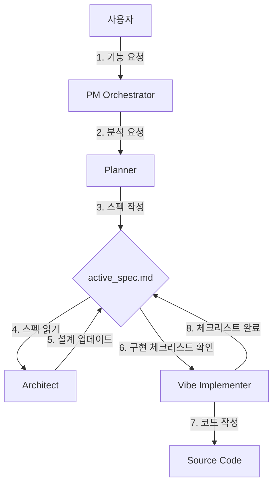

# Claude Code ClaudeVibeFlow (v2.0)

> **"파일이 상태를 관리하고, AI는 그 상태를 따른다."**
>
> 진정한 **바이브 코딩(Vibe Coding)**을 위한 파일 기반 상태 머신(File-Based State Machine) 플러그인입니다.

[English Documentation](README.md)

---

## 🌟 무엇이 달라졌나요? (v2.0 철학)

기존의 "채팅(Chat)" 기반 코딩은 **맥락 표류(Context Drift)**에 취약했습니다. 대화가 길어지면 초기의 계획은 잊혀지고, AI는 환각을 일으키기 시작합니다.

**ClaudeVibeFlow**는 **Active Context Architecture**를 통해 이 문제를 해결합니다.

1.  **칠판(Blackboard) 패턴**: 모든 에이전트는 채팅 내역이 아니라 `.vibe-flow/active_spec.md`라는 **공유된 칠판**을 바라보고 작업합니다.
2.  **규격화된 흐름**: `생각(Planner)` -> `기록(File)` -> `구현(Implementer)`의 흐름이 강제됩니다.
3.  **지속성(Persistence)**: 컴퓨터를 껐다 켜도, 당신의 프로젝트 상태는 파일 시스템에 그대로 남아있습니다.

---

## 🚀 시작하기 (Getting Started)

### 1단계: 설치 (Installation)

```bash
# 플러그인 마켓플레이스에서 설치 (권장)
/plugin install claude-vibe-flow

# 또는 로컬 설치
claude --plugin-dir ./claude-vibe-flow
```

### 2단계: 환경 초기화 (Bootstrap)

프로젝트 루트에서 다음 명령어를 실행하여 "바이브 환경"을 구축하세요. 이것이 **가장 중요한** 단계입니다.

```bash
/claude-vibe-flow:init
```

> **결과**: `.vibe-flow/` 디렉토리와 `active_spec.md` 칠판이 생성됩니다. 이제 에이전트들이 일할 준비가 되었습니다.

### 3단계: 바이브 코딩 시작 (Start Vibe)

이제 맥락 걱정 없이 기능을 요청하세요.

```bash
/claude-vibe-flow:new-feature "소셜 로그인 기능 만들어줘"
```

---

## 🔄 워크플로우 (How It Works)

이 플러그인은 아래의 순환 구조를 통해 "속도"와 "정확성"을 동시에 잡습니다.



1.  **Planner**: 당신의 모호한 말을 구체적인 요구사항으로 바꿔 `active_spec.md`에 **적습니다**.
2.  **Architect**: 기술적 결정을 `active_spec.md`에 **추가합니다**.
3.  **Implementer**: `active_spec.md`의 체크리스트를 하나씩 지워가며 코드를 **구현합니다**.
4.  **User**: 당신은 그저 이 과정이 흘러가는 것을 지켜보며 감독하면 됩니다.

---

## 🤖 에이전트 목록 (Agents)

Claude는 description 기반으로 이 에이전트들을 **자동으로 호출**합니다.

| 분류 | 에이전트 | 역할 | 트리거 조건 |
|------|----------|------|-------------|
| 🟣 **Core** | `pm-orchestrator` | **지휘자**. 복잡도를 분석하고 팀을 꾸립니다. | 복잡한 기능 요청 |
| 🔵 **Plan** | `planner` | **서기**. 칠판(`active_spec.md`)에 요구사항을 정리합니다. | 모호한 요청 |
| 🔵 **Plan** | `architect` | **설계자**. 기술 스택을 결정하고 칠판에 기록합니다. | 기술적 의사결정 |
| 🟠 **Action** | `vibe-implementer` | **시공자**. 칠판을 보고 코드를 짭니다. | 명확한 구현 요청 |
| 🟢 **Quality** | `spec-validator` | **감리**. 칠판의 내용이 충분한지 검사합니다. | 구현 시작 전 |
| 🟢 **Quality** | `code-reviewer` | **검토자**. 구현된 코드가 칠판의 내용과 맞는지 봅니다. | 코드 변경 후 |
| ⚪ **Support** | `task-manager` | **관리자**. 작업이 끝나면 칠판을 지우고 정리합니다. | 세션 시작/종료 |

---

## 🛠 명령어 (Commands)

| 명령어 | 설명 | 예시 |
|--------|------|------|
| `/claude-vibe-flow:init` | **[필수]** 프로젝트에 바이브 환경(`.vibe-flow`)을 설정합니다. | - |
| `/claude-vibe-flow:new-feature` | 전체 구현 파이프라인(기획~구현~검증)을 실행합니다. | `/claude-vibe-flow:new-feature "결제 모듈"` |
| `/claude-vibe-flow:check-setup` | 플러그인 설치 상태와 의존성을 확인합니다. | - |

---

## ⚡ 팁: 바이브를 유지하는 법

1.  **"파일을 믿으세요"**: 채팅창에 긴 설명을 다시 쓸 필요가 없습니다. "Spec 파일 확인해" 한마디면 에이전트는 알아듣습니다.
2.  **"초기화는 한 번만"**: `init`은 프로젝트당 한 번이면 충분합니다.
3.  **"작게 시작하세요"**: `new-feature`는 거대한 기능보다 "로그인", "헤더 수정" 같은 단위 작업에 최적화되어 있습니다.
