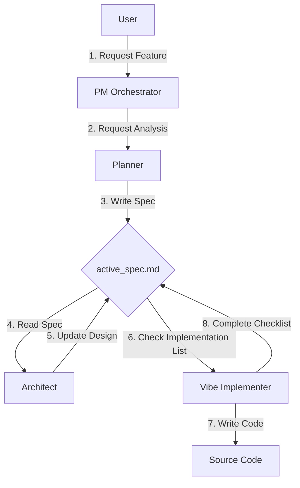

# Claude Code ClaudeVibeFlow (v2.0)

> **"Files manage the state, AI follows the state."**
>
> A File-Based State Machine plugin for **True Vibe Coding**.

[한국어 문서 (Korean Documentation)](README.ko.md)

---

## 🌟 What Changed? (Philosophy v2.0)

Traditional "Chat-based" coding is vulnerable to **Context Drift**. As conversations grow longer, initial plans are forgotten, and AI starts to hallucinate.

**ClaudeVibeFlow** solves this with the **Active Context Architecture**.

1.  **Blackboard Pattern**: All agents work off a **shared blackboard** located at `.vibe-flow/active_spec.md`, not just the chat history.
2.  **Standardized Flow**: The flow of `Think (Planner)` -> `Record (File)` -> `Implement (Implementer)` is enforced.
3.  **Persistence**: Even after a restart, your project state remains intact in the file system.

---

## 🚀 Getting Started

### Step 1: Installation

```bash
# Install via Plugin Marketplace (Recommended)
/plugin install claude-vibe-flow

# Or Local Installation
claude --plugin-dir ./claude-vibe-flow
```

### Step 2: Bootstrap Environment

Run this command at the project root to set up the "Vibe Environment". This is the **most important** step.

```bash
/claude-vibe-flow:init
```

> **Result**: A `.vibe-flow/` directory and `active_spec.md` blackboard are created. The agents are now ready to work.

### Step 3: Start Vibe Coding

Request features without worrying about losing context.

```bash
/claude-vibe-flow:new-feature "Create a social login feature"
```

---

## 🔄 Workflow (How It Works)

This plugin captures both "Speed" and "Accuracy" through the following cycle:



1.  **Planner**: Converts your vague ideas into concrete requirements and **writes** them to `active_spec.md`.
2.  **Architect**: **Adds** technical decisions to `active_spec.md`.
3.  **Implementer**: **Implements** code by crossing off items from the `active_spec.md` checklist.
4.  **User**: You simply supervise the process as it flows.

---

## 🤖 Agents

Claude automatically selects these agents based on their descriptions.

| Category | Agent | Role | Trigger Condition |
|----------|-------|------|-------------------|
| 🟣 **Core** | `pm-orchestrator` | **Conductor**. Analyzes complexity and assembles the team. | Complex feature requests |
| 🔵 **Plan** | `planner` | **Scribe**. Organizes requirements on the blackboard (`active_spec.md`). | Ambiguous requests |
| 🔵 **Plan** | `architect` | **Designer**. Decides tech stack and records it on the blackboard. | Technical decisions |
| 🟠 **Action** | `vibe-implementer` | **Builder**. Writes code by looking at the blackboard. | Clear implementation requests |
| 🟢 **Quality** | `spec-validator` | **Auditor**. Checks if the blackboard content is sufficient. | Before implementation starts |
| 🟢 **Quality** | `code-reviewer` | **Reviewer**. Checks if the code matches the blackboard. | After code changes |
| ⚪ **Support** | `task-manager` | **Manager**. Cleans the blackboard after the task is done. | Session start/end |

---

## 🛠 Commands

| Command | Description | Example |
|---------|-------------|---------|
| `/claude-vibe-flow:init` | **[Required]** Sets up the Vibe environment (`.vibe-flow`). | - |
| `/claude-vibe-flow:new-feature` | Executes the full implementation pipeline (Plan -> Impl -> Verify). | `/claude-vibe-flow:new-feature "Payment Module"` |
| `/claude-vibe-flow:check-setup` | Verifies plugin installation and dependencies. | - |

---

## ⚡ Tips: How to Keep the Vibe

1.  **"Trust the File"**: No need to rewrite long explanations in the chat. "Check the Spec file" is all you need to say.
2.  **"Init Once"**: Run `init` only once per project.
3.  **"Start Small"**: `new-feature` is optimized for atomic tasks like "Login" or "Fix Header", rather than massive system overhauls.
