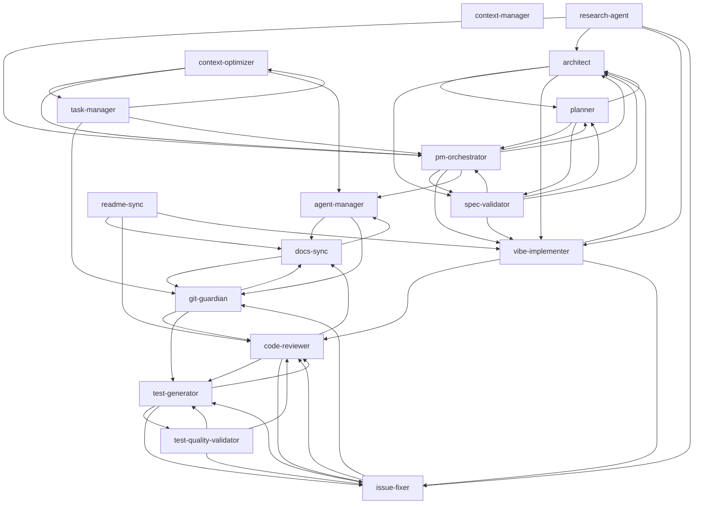

# Agent Dependency Graph

> Auto-generated from agent markdown files. Do not edit manually.
> Run `npx ts-node scripts/generate-agent-graph.ts` to regenerate.

## Visualization

## Agent Details

| Agent | Dependencies | Triggers |
|-------|--------------|----------|
| `agent-manager` | `docs-sync`, `git-guardian` | User wants to create, add, or modify agents; User ... |
| `architect` | `planner`, `spec-validator`, `vibe-implementer` | User seeks advice on technical approach or methodo... |
| `code-reviewer` | `test-generator`, `issue-fixer`, `docs-sync` | After code changes (proactively); User requests co... |
| `context-manager` | - | - |
| `context-optimizer` | `task-manager`, `pm-orchestrator`, `agent-manager` | Context usage 50% or more; Attempting to access la... |
| `docs-sync` | `agent-manager`, `git-guardian` | After code implementation completion; After adding... |
| `git-guardian` | `docs-sync`, `code-reviewer`, `test-generator` | - |
| `issue-fixer` | `code-reviewer`, `test-generator`, `git-guardian` | User reports something is broken or not working as... |
| `planner` | `pm-orchestrator`, `architect`, `spec-validator` | User expresses vague ideas or wishes without clear... |
| `pm-orchestrator` | `planner`, `architect`, `spec-validator`, `vibe-implementer`, `agent-manager` | User requests new feature or functionality; User p... |
| `readme-sync` | `docs-sync`, `code-reviewer`, `vibe-implementer` | Public API signature changes; Configuration option... |
| `research-agent` | `pm-orchestrator`, `architect`, `vibe-implementer`, `issue-fixer` | User asks how to use an external library, framewor... |
| `spec-validator` | `planner`, `architect`, `pm-orchestrator`, `vibe-implementer` | `planner` completes requirement definition; `archi... |
| `task-manager` | `git-guardian`, `context-optimizer`, `pm-orchestrator` | Session or major Task commencement; Periodic inter... |
| `test-generator` | `test-quality-validator`, `code-reviewer`, `issue-fixer` | User requests test creation, verification, or cove... |
| `test-quality-validator` | `test-generator`, `code-reviewer`, `issue-fixer` | After completion of `test-generator` tasks.; When ... |
| `vibe-implementer` | `architect`, `code-reviewer`, `issue-fixer` | User has clear, explicit implementation requiremen... |

## Dependency Matrix

| Agent | Depends On | Depended By |
|-------|------------|-------------|
| `agent-manager` | `docs-sync`, `git-guardian` | `context-optimizer`, `docs-sync`, `pm-orchestrator` |
| `architect` | `planner`, `spec-validator`, `vibe-implementer` | `planner`, `pm-orchestrator`, `research-agent`, `spec-validator`, `vibe-implementer` |
| `code-reviewer` | `test-generator`, `issue-fixer`, `docs-sync` | `git-guardian`, `issue-fixer`, `readme-sync`, `test-generator`, `test-quality-validator`, `vibe-implementer` |
| `context-manager` | - | - |
| `context-optimizer` | `task-manager`, `pm-orchestrator`, `agent-manager` | `task-manager` |
| `docs-sync` | `agent-manager`, `git-guardian` | `agent-manager`, `code-reviewer`, `git-guardian`, `readme-sync` |
| `git-guardian` | `docs-sync`, `code-reviewer`, `test-generator` | `agent-manager`, `docs-sync`, `issue-fixer`, `task-manager` |
| `issue-fixer` | `code-reviewer`, `test-generator`, `git-guardian` | `code-reviewer`, `research-agent`, `test-generator`, `test-quality-validator`, `vibe-implementer` |
| `planner` | `pm-orchestrator`, `architect`, `spec-validator` | `architect`, `pm-orchestrator`, `spec-validator` |
| `pm-orchestrator` | `planner`, `architect`, `spec-validator`, `vibe-implementer`, `agent-manager` | `context-optimizer`, `planner`, `research-agent`, `spec-validator`, `task-manager` |
| `readme-sync` | `docs-sync`, `code-reviewer`, `vibe-implementer` | - |
| `research-agent` | `pm-orchestrator`, `architect`, `vibe-implementer`, `issue-fixer` | - |
| `spec-validator` | `planner`, `architect`, `pm-orchestrator`, `vibe-implementer` | `architect`, `planner`, `pm-orchestrator` |
| `task-manager` | `git-guardian`, `context-optimizer`, `pm-orchestrator` | `context-optimizer` |
| `test-generator` | `test-quality-validator`, `code-reviewer`, `issue-fixer` | `code-reviewer`, `git-guardian`, `issue-fixer`, `test-quality-validator` |
| `test-quality-validator` | `test-generator`, `code-reviewer`, `issue-fixer` | `test-generator` |
| `vibe-implementer` | `architect`, `code-reviewer`, `issue-fixer` | `architect`, `pm-orchestrator`, `readme-sync`, `research-agent`, `spec-validator` |