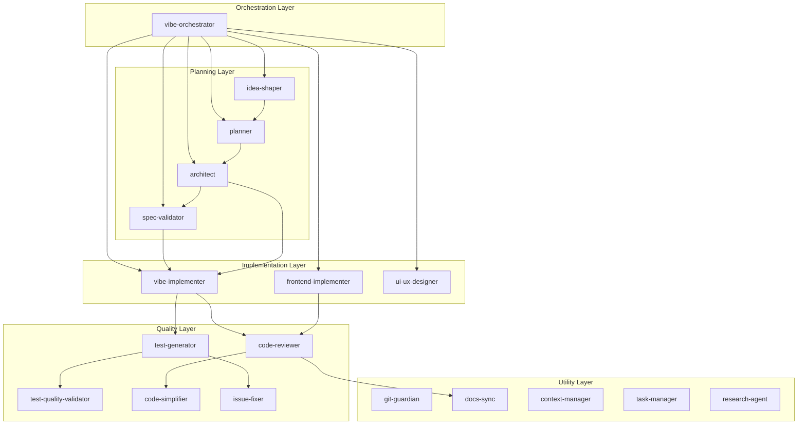

# Architecture Critical Analysis Report

> **Date**: 2026-01-06  
> **Type**: Deep Analysis - Critical, Objective Evaluation  
> **Subject**: claude-vibe-flow Agent Orchestration Architecture

---

## Executive Summary

This report provides a critical, objective analysis of the claude-vibe-flow architecture. While the framework presents ambitious ideas for AI-assisted development workflows, several fundamental design issues require attention.

**Key Finding**: The framework suffers from **"solving complexity with complexity"** - the solution introduces more cognitive overhead than the problems it aims to solve.

---

## 1. Fundamental Design Flaws

### 1.1 The "Agent" Illusion

```
┌─────────────────────────────────────────────────────────────────────────────────────┐
│                        Core Problem: Illusion vs Reality                            │
└─────────────────────────────────────────────────────────────────────────────────────┘

   [Illusion]                                 [Reality]
   ┌─────────────────┐                       ┌─────────────────┐
   │ vibe-orchestrator│    executes →        │  Claude (Single)│
   │        │         │                      │        ↓        │
   │        ▼         │                      │  Prompt Injection│
   │    planner       │                      │  (markdown added │
   │        │         │                      │   to context)    │
   │        ▼         │                      │        ↓        │
   │ vibe-implementer │                      │  Same Claude does│
   └─────────────────┘                       │  all the work    │
                                             └─────────────────┘
```

**Critical Issues:**
- Claude Code plugins don't execute independent "agents"
- These are simply **prompt fragments** auto-routed by `description` field
- No true parallel execution, isolated memory, or independent decision-making
- Marketing terminology ("22 specialized agents") misaligns with technical reality

**Recommendation**: Rename to "Role Prompts" or "Expert Modes" to reflect actual implementation.

---

### 1.2 Single Point of Failure (SPOF)

```
                    ┌──────────────────────────────────────┐
                    │        vibe-orchestrator             │
                    │      (Entry point for ALL requests)  │
                    └─────────────────┬────────────────────┘
                                      │
         ┌────────────────────────────┼────────────────────────────┐
         │                            │                            │
         ▼                            ▼                            ▼
    [idea-shaper]               [planner]                 [vibe-implementer]
```

**Issues:**
- Orchestrator prompt quality degrades as it grows longer
- Complex decision logic depends on a single markdown file
- Errors cascade through entire pipeline
- "Phase 0: Init Check" completely blocks if `.claude-vibe-flow/` is missing

---

### 1.3 Circular Dependencies and Infinite Loop Risk

From `docs/agent-dependency-graph.md`:

```
   code-reviewer ←→ code-simplifier
        │                 │
        └─────────────────┘
        
   planner ←→ architect ←→ spec-validator
       │           │            │
       └───────────┴────────────┘
```

**Risks:**
- `code-reviewer` calls `code-simplifier` → `code-simplifier` calls `code-reviewer`
- Anti-Paralysis Protocol exists but relies on LLM "judgment" (unstable)
- No hard enforcement mechanism for loop prevention

---

## 2. Structural Complexity Issues

### 2.1 Agent Redundancy Analysis

```
┌─────────────────────────────────────────────────────────────────────────────────────┐
│                         Agent Role Overlap Analysis                                 │
└─────────────────────────────────────────────────────────────────────────────────────┘

   Suspected Overlap Group 1: Implementation
   ├─ vibe-implementer     "fast implementation across any technical domain"
   ├─ frontend-implementer "Frontend implementation (React 19, Svelte 5...)"
   └─ Question: Why separate? → Same LLM, same capabilities, different prompts only
            
   Suspected Overlap Group 2: Planning
   ├─ idea-shaper   "transforms vague ideas into validated concepts"
   ├─ planner       "clarifies requirements through Socratic dialogue"
   └─ Distinction criteria unclear: "idea-level vague" vs "requirement-level vague"
   
   Suspected Overlap Group 3: Documentation
   ├─ docs-sync     "Automatic CLAUDE.md synchronization"
   ├─ readme-sync   "README synchronization for public APIs"
   └─ Why 2? One is sufficient.

   Suspected Overlap Group 4: Testing
   ├─ test-generator         "Test generation"
   ├─ test-quality-validator "Test quality assessment"
   └─ Separation necessity unclear
```

**Consolidation Proposal (22 → 8-10):**

| Current | Proposed Consolidation |
|---------|------------------------|
| vibe-implementer + frontend-implementer | `implementer` |
| idea-shaper + planner | `planner` |
| code-reviewer + test-quality-validator | `reviewer` |
| docs-sync + readme-sync | `doc-manager` |
| issue-fixer | `issue-handler` |
| architect | `architect` |
| spec-validator | `validator` |
| context-manager + context-optimizer | `context-manager` |
| git-guardian | `git-guardian` |
| task-manager | `task-manager` |

---

### 2.2 Context Window Exhaustion

```
┌─────────────────────────────────────────────────────────────────────────────────────┐
│                         Token Consumption Analysis (Estimated)                      │
└─────────────────────────────────────────────────────────────────────────────────────┘

   SessionStart hook → load-context.sh executes
                         │
                         ▼
   .claude-vibe-flow/ entire directory loaded
                         │
                         ▼
   Agent markdown loaded on orchestrator call
   ├─ vibe-orchestrator.md: ~358 lines
   ├─ planner.md: ~282 lines  
   ├─ idea-shaper.md: ~326 lines
   └─ ... (additional per call)
                         │
                         ▼
   ┌────────────────────────────────────────┐
   │ Cumulative context: 5000-15000+ tokens │
   │ (consumed before actual work begins)   │
   └────────────────────────────────────────┘
```

**Issues:**
- Longer pipelines = increased context pressure
- Intermediate agent results accumulate, degrading later agent performance
- `context-optimizer` agent exists but... it also consumes context

---

## 3. Protocol Contradictions and Inconsistencies

### 3.1 Anti-Paralysis Protocol Paradox

```
┌─────────────────────────────────────────────────────────────────────────────────────┐
│                    Anti-Paralysis Causes Paralysis                                  │
└─────────────────────────────────────────────────────────────────────────────────────┘

   Sections present in every agent:
   ├─ vibe-orchestrator: "Anti-Paralysis Protocol" (~60 lines)
   ├─ planner: "Anti-Paralysis Protocol" (~50 lines)
   ├─ idea-shaper: "Anti-Paralysis Protocol" (~30 lines)
   ├─ vibe-implementer: "Anti-Paralysis Protocol" (~40 lines)
   ├─ spec-validator: "Anti-Paralysis Protocol" (~40 lines)
   └─ hooks.json: "EXPLORATION CHECKPOINT" (~20 lines)
   
   Total: 200+ lines of "paralysis prevention" rules
```

**Irony:**
- Rules to "prevent analysis paralysis" span 200+ lines
- Reading and evaluating these rules itself causes paralysis
- Every agent repeats the same warnings → duplication + noise

**hooks.json PreToolUse example:**
```
"EXPLORATION CHECKPOINT - Before reading, answer:
 1. SEEKING: What specific info am I looking for?
 2. GAP: Why don't files I've already seen have this?
 3. AFTER: What will I DO after finding this?
 4. ALTERNATIVE: Can I assume and verify by DOING instead?"
```

- Intent: Prevent unnecessary exploration
- Reality: Adds cognitive overhead to every Read operation

---

### 3.2 Handoff Protocol: Definition Without Implementation

```yaml
# Defined in vibe-orchestrator.md:
handoff:
  task_id: "unique-id"
  source: "vibe-orchestrator"
  target: "planner"
  context:
    original_request: "..."
```

**Issues:**
- No mechanism to actually parse and transmit this YAML structure
- Claude Code plugin spec has no "handoff" API
- Pure wishful thinking that "LLM will follow this format"
- Actual behavior: Simple prompt switching (no state preservation guarantee)

---

### 3.3 active_spec.md Dependency: Fragile State Management

```
┌─────────────────────────────────────────────────────────────────────────────────────┐
│                         File-Based State Management Limitations                     │
└─────────────────────────────────────────────────────────────────────────────────────┘

   Expected Flow:
   idea-shaper → creates active_spec.md
                      ↓
   planner → updates "## 2. Requirements" section
                      ↓
   architect → updates "## 3. Technical Design" section
                      ↓
   vibe-implementer → reads and follows spec
```

**Failure Scenarios:**

| Scenario | Description | Mitigation |
|----------|-------------|------------|
| Concurrency | 2 Claude sessions modify active_spec.md simultaneously | conflict-resolver exists but requires manual invocation |
| Sync Failure | LLM ignores/forgets "update active_spec.md" instruction | None |
| Schema Mismatch | Each agent only knows "its section" | No whole-schema enforcement |
| Unrecoverable State | Session terminates mid-process | "Status: In Progress" persists forever |

---

## 4. Testing and Verification Gaps

```
┌─────────────────────────────────────────────────────────────────────────────────────┐
│                              tests/unit/ Analysis                                   │
└─────────────────────────────────────────────────────────────────────────────────────┘

   Existing Tests:
   ├─ validate-agents.test.ts    → Markdown structure (frontmatter exists?)
   ├─ validate-commands.test.ts  → Markdown structure
   ├─ validate-plugin.test.ts    → plugin.json reference integrity
   ├─ validate-hooks.test.ts     → hooks.json structure
   └─ cli-e2e.test.ts            → CLI installation flow
   
   Missing Tests:
   ├─ Agent routing logic tests (NONE)
   ├─ Pipeline execution simulation (NONE)
   ├─ Anti-Paralysis rule compliance verification (NONE)
   ├─ active_spec.md synchronization verification (NONE)
   └─ Actual Claude response quality tests (NONE)
```

**Conclusion**: "Structure is validated but behavior is not" - tests pass if markdown files exist.

---

## 5. Design Philosophy Contradictions

```
┌─────────────────────────────────────────────────────────────────────────────────────┐
│                           Declared Principles vs Actual Design                      │
└─────────────────────────────────────────────────────────────────────────────────────┘

   CLAUDE.md Declares:
   "Imperfect action beats perfect inaction."
   "80% confidence is enough to proceed."
   
   Actual Design:
   • 5-stage pipeline (idea → plan → design → implement → verify)
   • Validation gate at each stage
   • spec-validator can block with "NOT READY" verdict
   • hooks.json PreToolUse checkpoints
```

**Contradictions:**
- Emphasizes "fast execution" while implementing multi-layer verification
- Says "proceed with 80% confidence" but enforces READY/NOT_READY gates
- Mode system (Verify/Fast/Deep/Action) attempts complexity management → adds more complexity

---

## 6. Recommendations

### 6.1 Agent Consolidation (22 → 8-10)

| Priority | Action | Impact |
|----------|--------|--------|
| HIGH | Merge implementation agents | Reduce context overhead |
| HIGH | Merge planning agents | Simplify routing |
| MEDIUM | Merge documentation agents | Reduce maintenance |
| MEDIUM | Merge quality agents | Clearer responsibilities |

### 6.2 Orchestration Simplification

```
Current: 5-stage pipeline with multiple gates
Proposed: 2-level routing

   Request → [Need planning?] 
                │
       ┌────── YES ──────┐
       │                 │
       ▼                 ▼
   [planner]         [implementer]
       │                 │
       └────────┬────────┘
                ▼
           [reviewer] (optional)
```

### 6.3 Anti-Paralysis Centralization

| Current | Proposed |
|---------|----------|
| 200+ lines across all agents | Single location in hooks.json |
| Repeated in every agent | 50% rule reduction |
| Per-agent variations | Unified rules |

### 6.4 State Management Improvements

| Issue | Solution |
|-------|----------|
| Schema drift | JSON Schema enforcement for active_spec.md |
| Version control | Auto-commit on spec changes |
| Conflict detection | Automated detection (not manual) |
| Recovery | Clear state machine with recovery paths |

### 6.5 Testing Additions

| Test Type | Description |
|-----------|-------------|
| Routing Decision Tests | Verify correct agent selection |
| Pipeline Integration Tests | End-to-end flow validation |
| LLM Output Simulation | Mock responses for deterministic testing |
| State Sync Tests | Verify active_spec.md consistency |

### 6.6 Terminology Correction

| Current | Proposed | Reason |
|---------|----------|--------|
| "Agent" | "Role Prompt" or "Expert Mode" | Reflects actual implementation |
| "Multi-Agent System" | "Role-Based Prompting" | Honest description |
| "Orchestrator" | "Router" | Simpler, accurate |

---

## 7. Final Assessment

| Aspect | Score | Evaluation |
|--------|-------|------------|
| Conceptual Design | 7/10 | Good ideas but over-engineered |
| Implementation Realism | 4/10 | Ignores LLM plugin limitations |
| Complexity Management | 3/10 | Solution more complex than problems |
| Test Coverage | 2/10 | Structure validated, behavior not |
| Practicality | 5/10 | Overhead for simple projects |
| Extensibility | 6/10 | Easy to add agents, hard to manage |

**Overall: 4.5/10**

---

## 8. Conclusion

claude-vibe-flow is an ambitious framework with valuable core ideas:
- Persistent context management
- Specialized role prompts for different tasks
- Quality verification loops

However, the current implementation suffers from fundamental issues:

1. **Terminology mismatch**: "Agents" are not agents
2. **Over-engineering**: 22 agents when 8-10 would suffice
3. **Self-contradicting protocols**: Anti-paralysis rules cause paralysis
4. **Untested behavior**: Only structure is validated
5. **Fragile state management**: File-based with no enforcement

**Core Recommendation**: Acknowledge the reality that this is a **single LLM with role-switching prompts**, not a multi-agent system. Simplify the design accordingly.

> "22 specialized agents" has marketing appeal, but simpler rules with fewer roles would likely be more effective in practice.

---

## Appendix: Agent Dependency Graph (Current)



---

*Report generated: 2026-01-06*  
*Analysis type: Critical/Objective*
